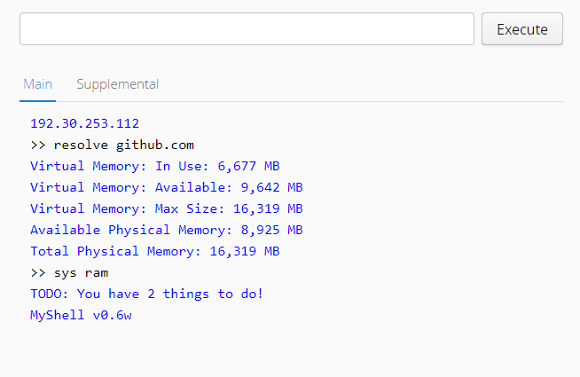

# MyShell project
<b>MyShell</b> is a project for home automation. It is java/vaadin based web console with old-school command line interface. 
MyShell - NetBeans project, main program. 
MyShell_helper - NetBeans project, helper program. Should be added to autorun list. 
Plugins\myshell_dateutils - NetBeans project. Date/time calculation utilities for MyShell. 
Plugins\myshell_linkchecker - NetBeans project. Webpage checker for MyShell. Can generate notification when specified word appears on specified webpage. Useful for monitoring 
Plugins\myshell_net - NetBeans project. "Ping" and "resolve" utils wrapper for MyShell. 
Plugins\myshell_reminder - NetBeans project. Simple reminder for MyShell. 
Plugins\myshell_sys - NetBeans project. RAM status, uptime and other information for MyShell. 
Plugins\myshell_todo - NetBeans project. Simple ToDo list for MyShell. 
Plugins\myshell_vmware - NetBeans project. Simple commandline access for VMWare Workstation for MyShell. MyShell_helper is required. 
